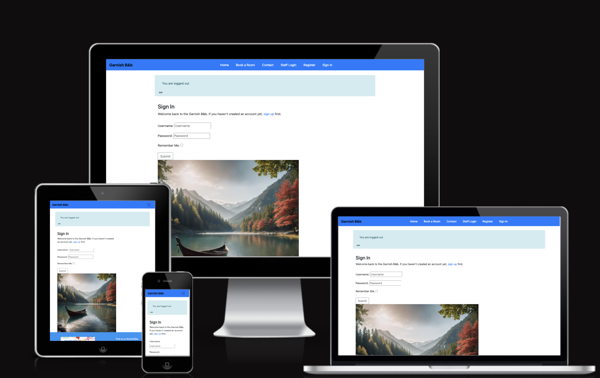

# GARNISH B&B

> Garnish B&b is small lovely guesthouse,website allow guests to book the room and also contact the hotel admin, Admin can create room number and checking contact request and delete unactive users . Created as a final Individual Project for Code Institute.

### [Deployed Link to the live site](https://my-final-project-2e49722f6d1b.herokuapp.com/)

#### - By Tuguldur Batsaikhan

---

## Table of contents 

 1. [ User Experience ](#ux)
 2. [ Agile Development ](#agile-development)
 3. [ Features implemented ](#features-implemented)  
 4. [ Features Left to Implement ](#features-left-to-implement)  
 5. [ Technology used ](#technology-used) 
 6. [ Testing ](#testing)  
 7. [ Bugs ](#known-bugs)  
 8. [ Deployment](#deployment)
 9. [ Resources ](#resources)  
 10. [ Credits and acknowledgements ](#credits-and-acknowledgements)

---

# User Experience

## Database Design 

#### Database Relational Table

- One day, a sophisticated woman approached me, requesting a small hotel booking website.(this product is not for commercial purpose and it is only for my experience)Despite the complexity of the task, I embraced the challenge, determined to create a minimal viable product (MVP). 
- I crafted the booking table and integrated a form model into the 'Contact Me' page, ensuring a seamless user experience."

#### Data models

---

> Models.py 

---

## UX design

### Overview

#### Design

> Initial design planning

Early design stage of this project included making png versions of a homepage and login page prototypes.
Thanks to that I could decide on the aesthetic choices before entering the coding stage.

I wanted the website to look modern, professional and welcoming. I chose the base colours to be in the shades of brown, black and white, as they may be associated with coffee.

#### Site User

- Someone over 16 years old from the café's area
- A cat loving person looking for the place to relax
- Someone who prefers to arrange their bookings digitally rather than over the phone or in person

#### Goals for the website

- To allow customers to see the menu before visiting the café
- To allow customers to plan their booking in advance
- To safely store the bookings data and make it available for designated staff to approve or decline it in an easy way

### Wireframes

Ux Design and sketch used BALSAMIQ tool [Balsamiq](https://balsamiq.com/).
The original sketch and planning of my website design closely aligned with the final MVP, resulting in a seamless transition from concept to execution.
> Wireframe of Home, Booking,Contact,Sign in,Sign up

##### [ Back to Top ](#table-of-contents)

---

# Agile Development

## Overview

I started this project alongside GitHub Projects with intention of planning and tracking the workflow to manage the expected workload. After setting out the epics for my project I broke them down into a set of user stories and smaller tasks, to help me monitor my progress and finish the website in time. Outside of user stories I also included a separate issues for creating each module of this README file, as I simply found it more motivating this way. To see the project's Kanban page please click [here](https://github.com/users/TulaUnogi/projects/3/views/1).

## User Stories

Initial stage of the project included stepping into the shoes of the future User. I thought about the features and functionality I would expect from the first use of the website and based on that I created a set of 12 User Stories. I labelled 10 of them as mandatory, as they provide the core functionality and source of important informations for the User. The remaining 2 Stories are labelled as NINTH- Nice To Have, Not Important, as they provide some improvements, but are not necessary for the User to enjoy the website's base functionality. 

The User Stories include the acceptance criteria and are broken down into smaller, bite- size tasks that I would tick on completion, so I could easily track my progress. During the coding session I would record the encountered bugs, issues and solutions related to the Story in the comments below. Once all of the tasks in the Issue are completed I would move the User Story form "In progress" to "Completed" card im my project's Kanban.

> List of Mandatory User Stories

1. [USER STORY: DEPLOYMENT](https://github.com/TulaUnogi/cat-beans-cafe/issues/16)
2. [USER STORY: ADMIN PANEL](https://github.com/TulaUnogi/cat-beans-cafe/issues/17)
3. [USER STORY: CREATE AN ACCOUNT](https://github.com/TulaUnogi/cat-beans-cafe/issues/18)
4. [USER STORY: EDITING PROFILE](https://github.com/TulaUnogi/cat-beans-cafe/issues/22)
5. [USER STORY: DELETING PROFILE](https://github.com/TulaUnogi/cat-beans-cafe/issues/23)
6. [USER STORY: TABLE BOOKING](https://github.com/TulaUnogi/cat-beans-cafe/issues/21)
7. [USER STORY: NAVBAR AND FOOTER](https://github.com/TulaUnogi/cat-beans-cafe/issues/20)
8. [USER STORY: ABOUT US](https://github.com/TulaUnogi/cat-beans-cafe/issues/19)
9. [USER STORY: MENU](https://github.com/TulaUnogi/cat-beans-cafe/issues/26)
10. [USER STORY: GOOGLE MAPS](https://github.com/TulaUnogi/cat-beans-cafe/issues/25)

> NINTH: Not Important, Nice To Have

11. [USER STORY: CAT CAROUSEL](https://github.com/TulaUnogi/cat-beans-cafe/issues/24)
12. [USER STORY: BOOKING CANCELLATION](https://github.com/TulaUnogi/cat-beans-cafe/issues/27)

##### [ Back to Top ](#table-of-contents)

---

# Features implemented

- [USER STORY: DEPLOYMENT](https://github.com/TulaUnogi/cat-beans-cafe/issues/16)
- [USER STORY: ADMIN PANEL](https://github.com/TulaUnogi/cat-beans-cafe/issues/17)
- [USER STORY: NAVBAR AND FOOTER](https://github.com/TulaUnogi/cat-beans-cafe/issues/20)
- [USER STORY: ABOUT US](https://github.com/TulaUnogi/cat-beans-cafe/issues/19)
- [USER STORY: MENU](https://github.com/TulaUnogi/cat-beans-cafe/issues/26)
- [USER STORY: GOOGLE MAPS](https://github.com/TulaUnogi/cat-beans-cafe/issues/25)
- [USER STORY: CREATE AN ACCOUNT](https://github.com/TulaUnogi/cat-beans-cafe/issues/18)
- [USER STORY: EDITING PROFILE](https://github.com/TulaUnogi/cat-beans-cafe/issues/22)
- [USER STORY: DELETING PROFILE](https://github.com/TulaUnogi/cat-beans-cafe/issues/23)
- [USER STORY: TABLE BOOKING](https://github.com/TulaUnogi/cat-beans-cafe/issues/21)
- [USER STORY: CAT CAROUSEL](https://github.com/TulaUnogi/cat-beans-cafe/issues/24)

### Navbar and Footer:

- Navbar and footer are present on every page
- Navbar's content changes depending on user authentication, allowing access to profile and user bookings
- Footer includes café's opening times, social links and address to provide the necessary informations in an easy way.

### Index page:

- The homepage provides the links to booking and about us page.
- It can be accessed without signing in.

### About Us page:

- Main page includes a short information about the café and set of 4 cards with pictures and description.
- Each of the card includes the button, that triggers a fullscreen modal.
- The modals contain informations about the menu, contact details with embedded google maps, link to booking page and gallery with cat pictures (cat carousel).
- About Us page can be accessed without signing in.

### Authentication and profile management:

- User can sign up to create their profile 
- User can log in to their account and update their informations
- User can delete their account alltogether with all their data
- The authentication process is safe thanks to [Django-AllAuth](https://github.com/pennersr/django-allauth) and csrf tokens.

### Bookings:

- User can pass their data to create a booking.
- User can edit their selected booking.
- Currently the initial version of booking cancellation view has not been fully implemented. I decided to implement an automatic delete_booking view, that allows User to quickly remove their booking from the system.

### Responsiveness:

- Website is responsive thanks to Bootstrap and media queries applied.
- There's a hamburger navbar on small devices.

##### [ Back to Top ](#table-of-contents)

---

# Features Left to Implement

- [USER STORY: BOOKING CANCELLATION](https://github.com/TulaUnogi/cat-beans-cafe/issues/27) - As I've mentioned the initial version of this model is left for now since customer can currently fully delete their booking. 

##### [ Back to Top ](#table-of-contents)

---

# Technology used 

- Html - for page structure
- CSS - for custom styling
- Python - for the backend
- Javascript - for timeout in messages
- Django - framework used to build this project
- Jinja - templating language rendering logic within html documents
- Bootstrap 5 - front end framework used by me alongside Django, helps with fast and efficient styling
- Heroku PostgreSQL - used as the database
- Font Awesome - for social media icons
- Google Fonts- currently only for the hero image font
- GitHub - for storing the code and for the projects Kanban
- Heroku - for hosting and deployement of this project
- Cloudinary - hosting the static files 
- Git - version control tool

##### [ Back to Top ](#table-of-contents)

---

# Testing

### Responsiveness

Testing for responsiveness done on Google pixel 7, Iphone14 Pro Max, Apple IPAD AIR, Macbook pro

> Index page:

> Room & Contact page before Sign In:

> Room Book page After Sign In:

> Contact page After Sign In:

> Sign Up page:

> Admin In page:

### Validator Testing 

- HTML
  - No errors were returned when passing through the official and one trailing slash warning occurred
- CSS
  - No errors were found when passing through the official 
  
  - JS
  - No errors were found when passing through the official and one warning of 80 more character in line
  

### Manual Testing

#### User Registration Tests
| Test |Result  |
|--|--|
| User can create account | Pass |
| User can log into account | Pass |
| User can log out from account | Pass |
| Pop up messages comes up when user signed in and out | Pass |
|user can not leave some field blank| Pass|

---

#### User Navigation from one link to other link Tests

| Test | Result  |
|--|--|
| User can easily navigate to Book room | Pass |
| User can access Home page without login| Pass|
| User access their booking details on book room page|Pass|
| User can access the sent request in contact page|Pass|
| SuperUser can access admin page going to staff link|Pass|

---

#### User Authorisation Tests

| Test | Result  |
|--|--|
| Super user can login to admin page |Pass|
| User not logged in can't go in to book room page| Pass |
| Non authorised user won't access to contact page| Pass|
|user can not leave some field blank| Pass|

---

#### Contact request Tests

| Test |Result  |
|--|--|
|User can send a request | Pass |
|User can list their previous request in contact page | Pass |
|User can delete or cancel their previous request  | Pass |
|User can update or add more request in contact page | Pass |
|User can book make another request | Pass |
|User can send request in contact page and pop up message display  | Pass |
|User can see the list of the previous request| Pass |

---

#### Booking Room Tests

| Test |Result  |
|--|--|
|User can choose room no and make a booking | Pass |
|User can list their room bookings list | Pass |
|User can delete or cancel their booked room | Pass |
|User can update room booking | Pass |
|User can book another booking if there is availibility | Pass |
|User can send request in contact page  | Pass |
|User can edit booked room | Pass |
|User can see the list of booked room information | Pass |

---

#### Admin Tests

| Test |Result  |
|--|--|
|Items display correctly on front-end when updated / added |Pass|
|Admin can view booked rooms and confirm and delete specific user and booking |Pass|
|Admin can create new rooms with number pof people and bed and capacity |Pass|

##### [ Back to Top ](#table-of-contents)

---
 
# Known bugs 

- I observed one blue submit button- it is automatically generated by crispy forms and somehow the form settings did not applied to this button. It's a small bug of low priority for me at the current stage.
- There's small image clipping during the cat carousel transitions on smaller screens.
- No error message displaying when passing wrong login details
- The function that was supposed to prevent booking dates in the past is currently preventing nothing, unfortunately... You may be brave and try to trick the system into timetravelling, but Admin will always see what day the booking was made on anyway and won't accept such a silly tricks!

##### [ Back to Top ](#table-of-contents)

---

# Deployment

#### The deployment stage of the website should follow the steps below:
>Create Github account

- Visit GitHub: Go to the GitHub website by typing "github.com" 
- Sign Up: On the GitHub homepage,
- Enter Your Information:
- Complete Verification: 
- the free plan (GitHub Free) is sufficient.
- Confirm Your Email:
- Set Up Your Profile: 
- explore  repositories, [use code institue template](https://github.com/Code-Institute-Org/ci-full-template)
- use this template button and get url link from your github.

>set up gitpod
- Create a GitHub Account (if you don't have one):
- Go to the GitHub website (github.com).
- Once you have a GitHub account, go to the Gitpod website (gitpod.io).
- Click on the "Sign in with GitHub" button.
- Follow the prompts to authorize Gitpod to access your GitHub account.
- Start a New Workspace:
- After signing in to Gitpod, you can start a new workspace by clicking on the "New Workspace" button.
- You'll be prompted to provide a repository URL or select a GitHub repository from your account.(remember you have created using codeinstitute template)
- Choose the repository you want to work on and customize any additional settings.
- Accessing Gitpod from GitHub:

> Create the Heroku app

- Create a Heroku Account:
- Go to the Heroku website (heroku.com) and sign up for an account if you don't already have one.
- Add and commit your code changes to the Git repository using the commands git add . and git commit -m "Initial commit". Push Your Code to Heroku:
- Deploy your app to Heroku by pushing your code to the Heroku remote using the command git push heroku main (replace main with your branch name if different).
Open Your App:

> Set up enviroment variables

- Log in to Heroku:
- Go to the Heroku website and log in to your account.
- Select Your App:(previously created)
- From the Heroku dashboard, select the app for which you want to set up environment variables.
- Go to Settings:
- Once you've selected the app, navigate to the "Settings" tab.
- Click on "Reveal Config Vars":
- Scroll down to the "Config Vars" section and click on the "Reveal Config Vars" button.
- Add Environment Variables:
- In the "Key" field, enter the name of your environment variable.(like  SECRET_KEY,DATABASE_URL,CLOUDINARY)
- In the "Value" field, enter the value for your environment variable.(LIKE PASSWORD YOU HAVE IN GITPOD IN ENV.PY)
- Click on the "Add" button to add the environment variable.
- Save Changes:

#### FORK this repository follow steps

- Navigate to Navigate to https://github.com/tugii21/Garnish the Repository:
- Go to the GitHub website and log in to your account.
- Locate the repository you want to fork by searching or browsing through your repositories.
- Fork the Repository:
- Once you've found the repository, click on the "Fork" button in the top-right corner of the repository page.
- This action will create a copy of the repository in your GitHub account.
- Wait for the Fork to Complete:
- GitHub will create the forked repository in your account. This process usually takes only a few seconds.
- Clone the Forked Repository:
- After the forking process is complete, navigate to the forked repository on your GitHub account.
- Click on the "Code" button and copy the HTTPS or SSH URL of the repository and paste to your worksation gitpid or codeanywhere.

##### [ Back to Top ](#table-of-contents)

---

# Resources used for these project and some of them are:

- [Django documentation material](https://learn.codeinstitute.net/)
- [Crispy forms installation from code institute](https://learn.codeinstitute.net/)
- [Stack overflow website](https://stackoverflow.com/)
- [Slack channel](https://slack.com/)

##### [ Back to Top ](#table-of-contents)

---

# Credits and acknowledgements

> Images

- [hotel booking](https://gencraft.com/generate) by <b>Gencraft</b>AI-powered art and video generation platform

> Code

- <b>[django allauth](https://learn.codeinstitute.net/)</b> Built in Django Allauth and followed on set up [Allauth templates]
- <b>[Code Insitute learning material](https://learn.codeinstitute.net/)</b> setting up django 
- <b>[Code Insitute learning material](https://learn.codeinstitute.net/)</b> setting up heroku
- <b>[Readme file template ideas from](https://github.com/TulaUnogi/cat-beans-cafe/blob/main/README.md)</b> setting up basic structure of readme
- <b>[Code Insitute learning material](https://learn.codeinstitute.net/)</b> setting up elephantSQL 
- <b>[Code Insitute learning material](https://learn.codeinstitute.net/)</b> setting up Django project and app and basic set up 
- <b>[Code Insitute CODING COACH](https://app.slack.com/client/T0L30B202/C066S26EDQX)</b> fix and debug code issue, Great help from Martin and Kevin code institute coding coach,and My menthor Gareth, facilitator David for motivation.
- <b>[Code Insitute SLACK CHANNEL](https://app.slack.com/)</b> exchange ideas with fellow students
- <b>[rich resource of internet](https://stackoverflow.com/)</b> thanks to search engine google,youtube,w3school,

##### [ Back to Top ](#table-of-contents)

